# 📂 Traditional EC2 to Amazon RDS Database Migration Project

A comprehensive, step-by-step engineering deployment demonstrating the migration of a production relational database layout from a standalone host environment (simulated on an Amazon EC2 instance) over to a high-availability, secure, and fully managed cloud database instance via Amazon RDS (MariaDB) deployed within the default VPC fabric.

---

## 🗺️ Architectural Workflow Overview

Below is the structural diagram illustrating the secure network paths, data dumps, and secure handshake operations executed to safely transfer database engines within the AWS infrastructure:

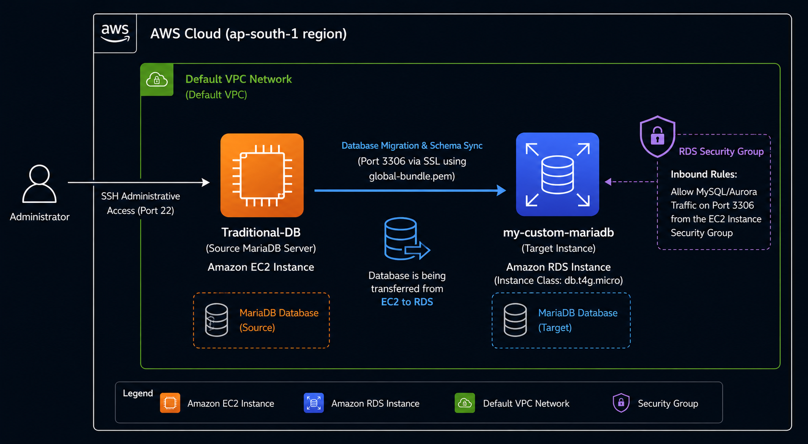

---

## 🛠️ Detailed Step-by-Step Execution Playbook

### Step 1: Provision the Source Infrastructure
An Amazon Linux 2023 EC2 instance named `Traditional-DB` was provisioned using a `t3.micro` instance class within the Mumbai (`ap-south-1b`) availability zone to act as our legacy source host environment.

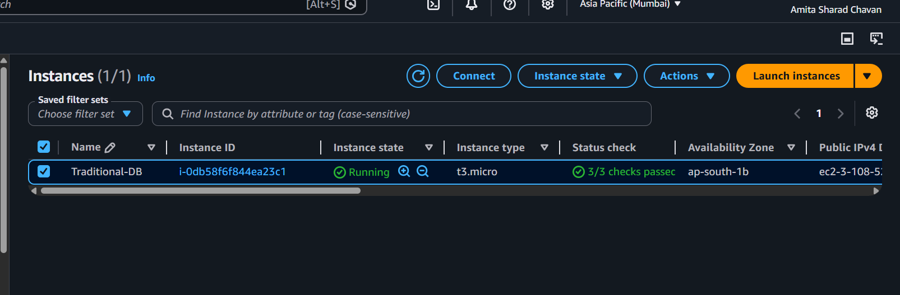

### Step 2: Initialize Target Amazon RDS Engine in the Default VPC
A managed Amazon RDS instance running a stable `MariaDB 10.6.27` engine was deployed on a `db.t4g.micro` burstable instance class. By intentionally utilizing the default network configurations, the database engine automatically inherited standard AWS regional availability subnets.

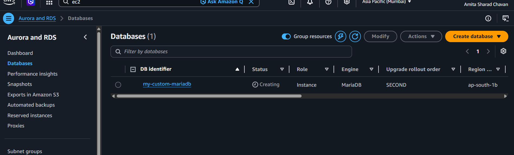

### Step 3: Configure Inbound Security Group Firewalls
To allow the local source machine to establish a secure network handshake with the database engine, inbound connection rules were added to the target security group mapping permissions for **MySQL/Aurora (Port 3306)**.

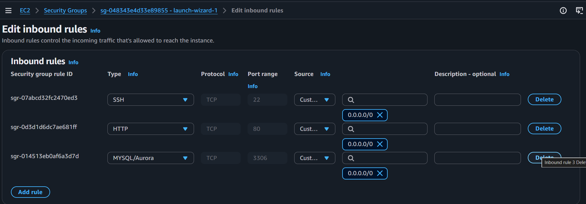

### Step 4: Securely Access the Source Host Machine
Using terminal shell configurations, an SSH connection was established directly into the public IP address of the newly deployed Amazon Linux EC2 instance.

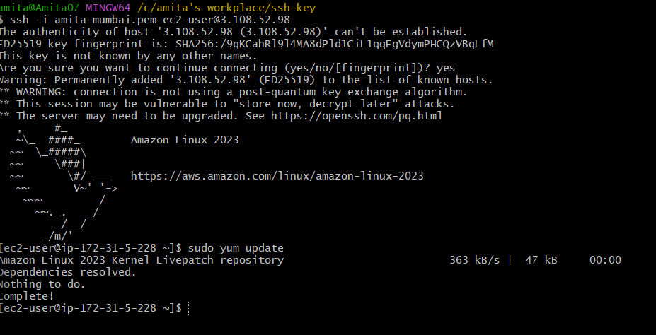

### Step 5: Install and Setup MariaDB Server Engine
The core database packages (`mariadb105-server`) were installed onto the source EC2 machine via the native system package manager.

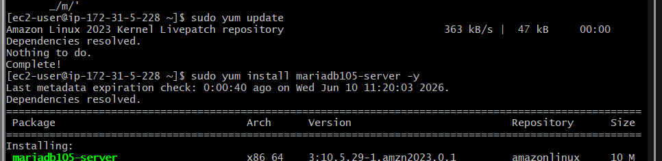

### Step 6: Create and Initialize the Source Database Schema
After initializing the relational engine locally, an active database environment named `instadb` was successfully established.

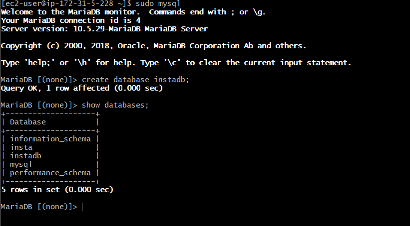

### Step 7: Populating Tables and Mock Data Records
A standard data tracking table named `user` was structuralized, populated with transaction rows, and audited locally using a select query.

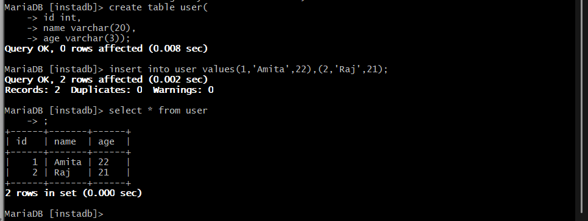

### Step 8: Verify Remote Connectivity and Setup RDS Target Schemas
The remote database endpoint was securely reached from the EC2 instance using an explicit SSL certificate bundle validation handshake (`global-bundle.pem`). A destination database layout was then prepared on the RDS cluster.

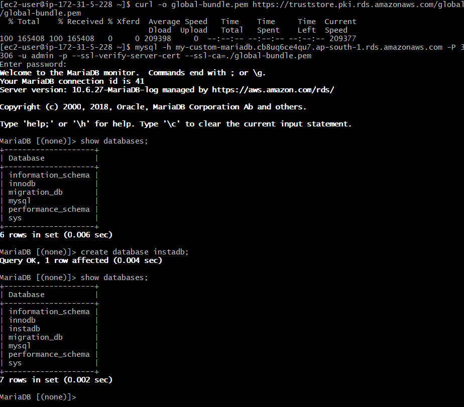

### Step 9: Extract a Clean Database Logical Dump File
To ensure zero data corruption during transit, the specific logical utility tool `mysqldump` was executed to generate a complete script representation copy named `real_insta_bkp.sql`.

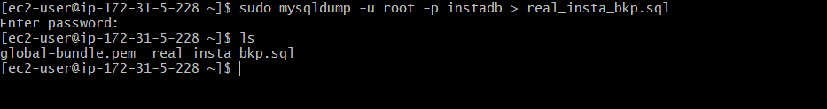

### Step 10: Import the Dump Data Layout into Amazon RDS
The logical backup file was piped directly over to the remote RDS engine endpoint. A final verification audit confirmed that all structural keys, tables, and record entries successfully transitioned to the managed cloud database cluster.

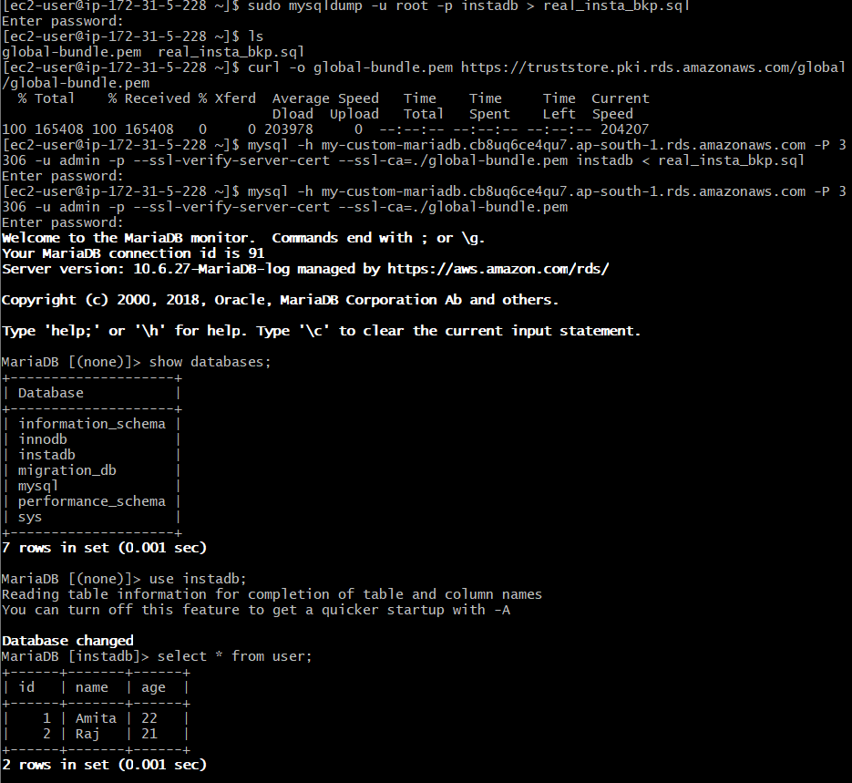

---

## 🎯 Key Engineering Takeaways
* **Default VPC Allocation:** Leveraged native platform infrastructure settings to route database traffic dynamically across AWS-managed regional pools without needing manual network segmentation masks.
* **Data Integrity Preservation:** Used specialized schema-dump practices via `mysqldump` to cleanly preserve constraints, data types, and index states across completely separate machine instances.
* **Encrypted Handshakes:** Successfully configured end-to-end SSL certificate chains to encrypt database connection streams in transit against potential sniffing vulnerabilities.
